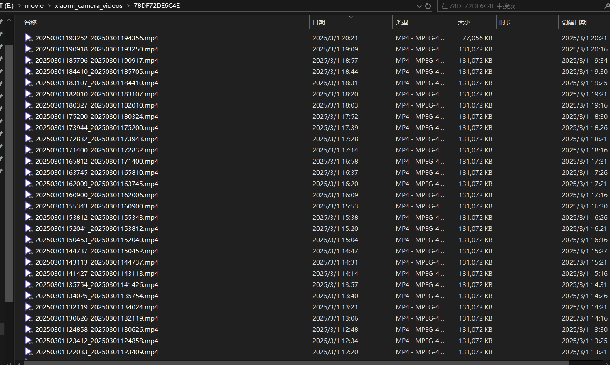
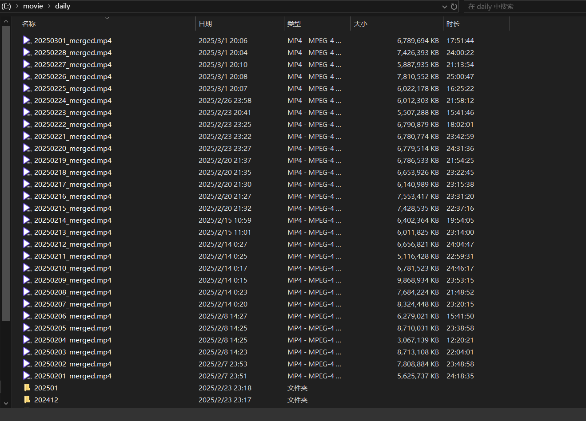
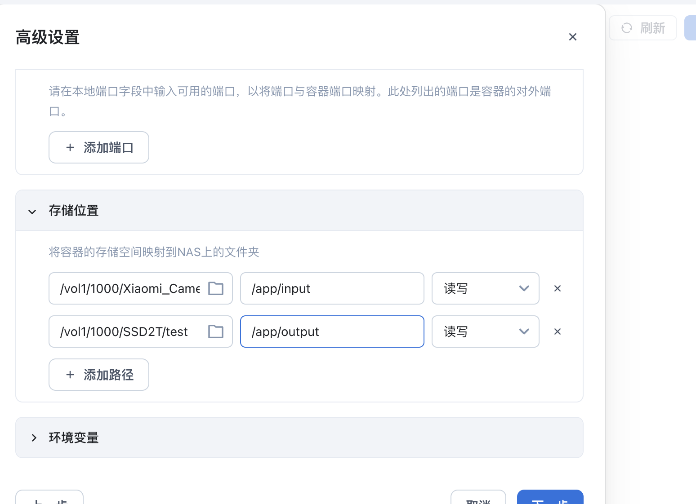

# xiaomi-camera-merge-tool

当前版本：`v4.0.1`

新款小米摄像头录像文件合并工具，将十几分钟一个的小视频按天合并为一个视频文件保存。

> v4.0.0 起只保留新款摄像头文件结构支持，移除了老款摄像头脚本和 `--old-cam` 参数。



## 功能

- 按文件名中的日期自动分组，将同一天的录像合并为 `YYYYMMDD.mp4`。
- 按文件名中的开始时间排序，适配 `00_20260516163622_20260516165427.mp4` 这类新款摄像头文件名。
- 自动跳过当天录像，避免合并仍在写入中的文件。
- 已存在 `YYYYMMDD.mp4` 时跳过该日期，只补合并缺失日期。
- 最终文件硬性限制不超过 5GB；超过时自动重压视频并保留音频原样。
- ffmpeg 只显示 warning/error，脚本日志只保留关键进度。
- 可选删除 output 目录中一周前的旧视频。

## 必要软件

非 Docker 环境需要提前准备好 Python 和 ffmpeg。

## 原生脚本用法

```bash
python all_in_one_merger.py --input <小米摄像头录像文件夹绝对路径> --output <保存视频的绝对路径>
```

举例：

```bash
python all_in_one_merger.py --input /e/movie/xiaomi_camera_videos/78DF72DE6C4E --output /e/movie/daily/
```

查看版本：

```bash
python all_in_one_merger.py --version
```

### 可选参数

```bash
--delete-old-videos
```

删除 output 文件夹中一周前的旧文件。适合把 output 作为 SSD 临时目录，再定时冷备份到 HDD 的使用方式。

## 文件结构

目前新款小米摄像头的文件结构基本如下，例如在米家 App 中指定 NAS 或 Windows 共享存储路径为 `E:\movie`，摄像头会在该目录下创建 `xiaomi_camera_videos` 目录，再按摄像头 UUID 存放录像文件。


合并后的视频会按天保存。以小米智能摄像头 3 Pro、3K 分辨率为例，每天原始视频大小大约 9GB，脚本会在需要时压缩到 5GB 以内。



## Docker

将录像文件的存储路径映射到容器的 `/app/input`，将合并后的视频保存路径映射到容器的 `/app/output`。

```bash
docker pull ghcr.io/2253845067/xiaomi-camera-merge-tool:4.0.1
```

默认命令会运行：

```bash
python all_in_one_merger.py --input /app/input --output /app/output
```

如需启用旧文件清理，在容器启动参数中追加：

```bash
--delete-old-videos
```

## NAS 示例



飞牛社区博客：https://club.fnnas.com/forum.php?mod=viewthread&tid=17854
